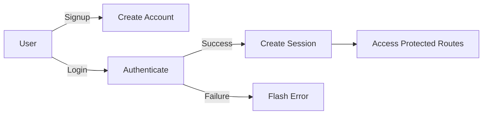

# 🏠 Travel Nest

> A full-stack web application for listing and discovering travel accommodations

Built with **Node.js** • **Express** • **MongoDB** • **EJS**

---

## ✨ Features

### 🔐 User Authentication
- ✅ Sign up and login functionality
- ✅ Passport.js integration with local strategy
- ✅ Secure session management
- ✅ Password hashing with passport-local-mongoose
- ✅ Persistent sessions (7-day expiry)

### 🏠 Listing Management
- ✅ Full CRUD operations for travel listings
- ✅ Image upload support with Multer
- ✅ Advanced filtering (price, location)
- ✅ Owner-based permissions
- ✅ Rich listing details

### ⭐ Review System
- ✅ Add reviews to listings
- ✅ Author attribution
- ✅ Delete reviews (authorized users only)
- ✅ Nested review population

### 💬 Flash Messages
- ✅ Success and error notifications
- ✅ User-friendly feedback system
- ✅ Contextual messages

### 🔍 Search & Filter
- ✅ Location-based search (case-insensitive)
- ✅ Price range filtering
- ✅ Real-time results

---

## 🛠️ Tech Stack

<table>
<tr>
<td align="center" width="33%">

### Backend


</td>
<td align="center" width="33%">

### Authentication


</td>
<td align="center" width="33%">

### Frontend


</td>
</tr>
</table>

### 📦 Core Dependencies

```json
{
  "express": "^5.1.0",
  "mongoose": "^8.19.1",
  "passport": "^0.7.0",
  "passport-local": "^1.0.0",
  "passport-local-mongoose": "^8.0.0",
  "multer": "^2.0.2",
  "cloudinary": "^1.41.3",
  "express-session": "^1.18.2",
  "connect-flash": "^0.1.1",
  "ejs": "^3.1.10",
  "ejs-mate": "^4.0.0"
}
```

---

## 🚀 Installation

### Prerequisites

Before you begin, ensure you have the following installed:
- **Node.js** (v18 or higher)
- **MongoDB** (v6 or higher)
- **npm** or **yarn**

### Step-by-Step Setup

1. **Clone the repository**
   ```bash
   git clone https://github.com/yourusername/travel-nest.git
   cd travel-nest
   ```

2. **Install dependencies**
   ```bash
   npm install
   ```

3. **Configure MongoDB**
   
   Make sure MongoDB is running locally:
   ```bash
   mongod
   ```
   
   Or update the connection string in `App.js`:
   ```javascript
   mongoose.connect("mongodb://127.0.0.1:27017/wanderlust");
   ```

4. **Seed the database** (Optional)
   ```bash
   node init.js
   ```
   
   > ⚠️ **Note:** Update the `ownerId` in `init.js` with a valid user ID after creating your first user.

5. **Start the server**
   ```bash
   node App.js
   ```
   
   Or use nodemon for development:
   ```bash
   npm install -g nodemon
   nodemon App.js
   ```

6. **Access the application**
   
   Open your browser and navigate to:
   ```
   http://localhost:8080
   ```

---

## 📁 Project Structure

```
travel-nest/
│
├── 📂 models/
│   ├── listing.js          # Listing schema & model
│   ├── review.js           # Review schema & model
│   └── user.js             # User schema & model
│
├── 📂 middleware/
│   └── middleware.js       # Authentication middleware
│
├── 📂 utils/
│   ├── wrapasync.js        # Async error handler wrapper
│   └── ExpressErrors.js    # Custom error class
│
├── 📂 views/
│   ├── 📂 listings/        # Listing-related views
│   │   ├── index.ejs       # All listings
│   │   ├── show.ejs        # Single listing
│   │   ├── new.ejs         # Create listing form
│   │   └── edit.ejs        # Edit listing form
│   ├── 📂 users/           # User authentication views
│   │   ├── signup.ejs      # Registration form
│   │   └── login.ejs       # Login form
│   ├── error.ejs           # Error page
│   └── layout.ejs          # Main layout template
│
├── 📂 public/              # Static assets
│   ├── css/
│   ├── js/
│   └── images/
│
├── 📂 uploads/             # Uploaded images storage
│
├── App.js                  # Main application file
├── init.js                 # Database seeding script
├── package.json            # Project dependencies
└── README.md               # You are here!
```

---

## 🛣️ API Routes

### 🔑 Authentication Routes

| Method | Endpoint | Description | Auth Required |
|--------|----------|-------------|---------------|
| `GET` | `/signup` | Display signup form | ❌ |
| `POST` | `/signup` | Register new user | ❌ |
| `GET` | `/login` | Display login form | ❌ |
| `POST` | `/login` | Authenticate user | ❌ |
| `GET` | `/logout` | Logout current user | ✅ |

### 🏠 Listing Routes

| Method | Endpoint | Description | Auth Required |
|--------|----------|-------------|---------------|
| `GET` | `/listings` | View all listings | ❌ |
| `GET` | `/listings?maxPrice=1000` | Filter by max price | ❌ |
| `GET` | `/listings?location=Paris` | Filter by location | ❌ |
| `GET` | `/listings/new` | Create listing form | ✅ |
| `POST` | `/listings` | Create new listing | ✅ |
| `GET` | `/listings/:id` | View single listing | ❌ |
| `GET` | `/listings/:id/edit` | Edit listing form | ✅ (Owner) |
| `PUT` | `/listings/:id` | Update listing | ✅ (Owner) |
| `DELETE` | `/listings/:id` | Delete listing | ✅ (Owner) |

### ⭐ Review Routes

| Method | Endpoint | Description | Auth Required |
|--------|----------|-------------|---------------|
| `POST` | `/listings/:id/reviews` | Add review | ✅ |
| `DELETE` | `/listings/:id/reviews/:reviewId` | Delete review | ✅ (Author) |

---

## 🔒 Authentication & Authorization

### Authentication Flow



### Authorization Rules

- 🔐 Users must be logged in to create, edit, or delete listings
- 👤 Only listing owners can edit or delete their listings
- ✍️ Only review authors can delete their reviews
- 💬 Flash messages provide real-time feedback
- ⏰ Sessions persist for 7 days with automatic renewal

---

## 🎨 Sample Data

The application includes **30 pre-configured sample listings** featuring:

<div align="center">

| 🏖️ Beachfront | 🏔️ Mountains | 🏙️ Urban | 🏰 Historic |
|---------------|--------------|----------|-------------|
| Cottages | Retreats | Lofts | Villas |
| Bungalows | Chalets | Penthouses | Castles |
| Villas | Cabins | Apartments | Houses |

</div>

Each listing includes:
- 📝 Title and detailed description
- 🖼️ High-quality image URL
- 💰 Price per night
- 📍 Location and country
- 👤 Owner reference

---

## ⚙️ Environment Configuration

### Development Setup

Create a `.env` file in the root directory:

```env
# Server Configuration
PORT=8080
NODE_ENV=development

# Database
MONGODB_URI=mongodb://127.0.0.1:27017/wanderlust

# Session
SESSION_SECRET=your_super_secret_key_here

# Cloudinary (Optional)
CLOUDINARY_CLOUD_NAME=your_cloud_name
CLOUDINARY_API_KEY=your_api_key
CLOUDINARY_API_SECRET=your_api_secret
```

### Production Setup

For production deployment:

1. **Update session configuration** in `App.js`:
   ```javascript
   app.use(session({
     secret: process.env.SESSION_SECRET,
     resave: false,
     saveUninitialized: false,
     cookie: {
       secure: true,  // Enable for HTTPS
       httpOnly: true,
       maxAge: 1000 * 60 * 60 * 24 * 7
     }
   }));
   ```

2. **Configure Cloudinary** for image storage
3. **Set up MongoDB Atlas** for cloud database
4. **Enable CORS** if needed
5. **Add rate limiting** for API protection

---

## 🐛 Error Handling

The application implements comprehensive error handling:

- ✅ Custom error handling middleware
- ✅ Async error wrapper for database operations
- ✅ 404 handler for unknown routes
- ✅ User-friendly error pages with detailed messages
- ✅ Validation error handling
- ✅ Authentication error feedback

---

## 🧪 Testing

```bash
# Run tests (configure test suite first)
npm test

# Run with coverage
npm run test:coverage
```

---

## 🚀 Deployment

### Deploy to Heroku

```bash
heroku create travel-nest
heroku addons:create mongolab
git push heroku main
```

### Deploy to Railway

1. Connect your GitHub repository
2. Add MongoDB plugin
3. Configure environment variables
4. Deploy automatically

---

## 🤝 Contributing

Contributions are welcome! Please follow these steps:

1. **Fork the repository**
2. **Create a feature branch**
   ```bash
   git checkout -b feature/AmazingFeature
   ```
3. **Commit your changes**
   ```bash
   git commit -m 'Add some AmazingFeature'
   ```
4. **Push to the branch**
   ```bash
   git push origin feature/AmazingFeature
   ```
5. **Open a Pull Request**

### Code Style

- Follow ESLint configuration
- Use meaningful variable names
- Comment complex logic
- Write clean, readable code

---

## 📝 License

This project is licensed under the **ISC License** - see the [LICENSE](LICENSE) file for details.

---

## 👤 Author

**Suraj Rawat**

- GitHub: [@SurajRawat](https://github.com/surajrawat)
- LinkedIn: [Suraj Rawat](https://linkedin.com/in/surajrawat)

---

## 🙏 Acknowledgments

- [Unsplash](https://unsplash.com/) for sample images
- [Express.js](https://expressjs.com/) for the amazing framework
- [MongoDB](https://www.mongodb.com/) for the database
- [Passport.js](http://www.passportjs.org/) for authentication

---

## 📞 Support

If you have any questions or need help, feel free to:

- 📧 Email: surajrawat@example.com
- 💬 Open an issue
- 🌟 Star this repository if you find it helpful!

---

<div align="center">

**Happy Traveling! ✈️🌍**

Made with ❤️ by Suraj Rawat

[⬆ Back to Top](#-travel-nest-)

</div>
